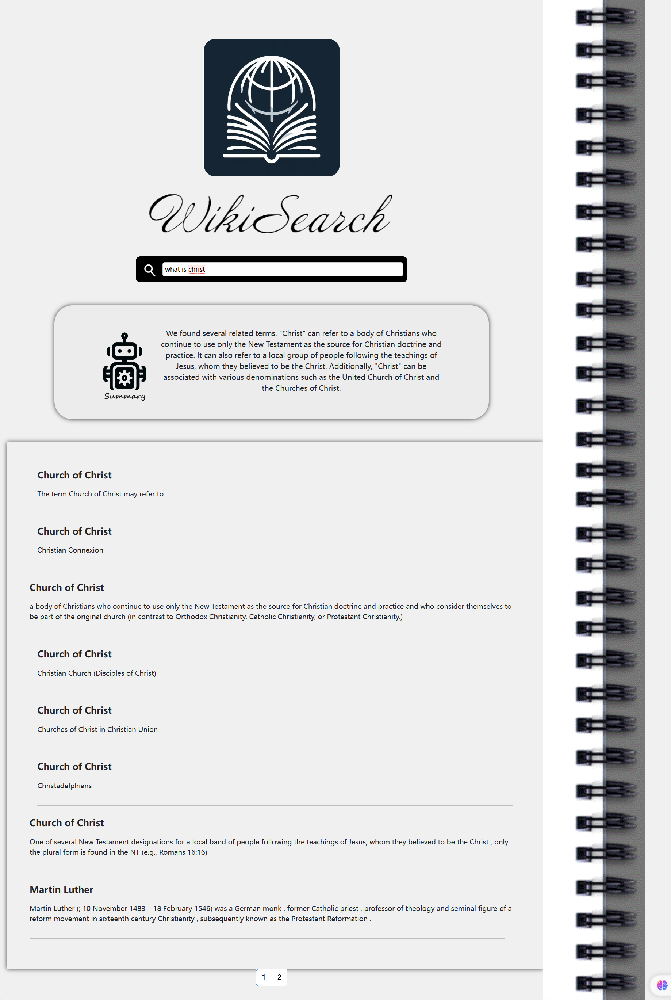

# WikiSearch: A search engine for Wikipedia Documents 


## Table of Contents
- [Demonstration](#Demo)
- [Quick Start](#Start)
- [Features](#Features)

## <a name="Demo"></a>Demonstration
We demostrated our software in Presentation Video
The interface looks like this:



## <a name="Start"></a>Quick Start
#### Frontend: 
1. Download and install Node.js from the official website: https://nodejs.org/en/download/.
2. Install Dependencies
``` shell
npm install --global serve
```
2. Run the frontend server
```shell
serve -s build
```
3. After it starts, open this URL in your browser: http://localhost:3000/search/christ

#### Backend: 
1. setup OpenAI api key environment variable 
For Windows Powershell: 
```shell
$env:OPENAI_API_KEY = {Your OpenAI API Token}
```
2. Enter the folder
```shell
cd backend 
```
3. Install the dependencies
```shell
pip install -r requirements.txt
```
4. Run the backend server
```shell
flask --app server run
```


## <a name="Features"></a>Features

Features includes:
- Sentence-transformer-based relevant terms retrieval
- Faiss acceleration
- LLM summarization
- Search bar
- Search prompts from search history
- Search results paging for better browsing
- User friendly interface


